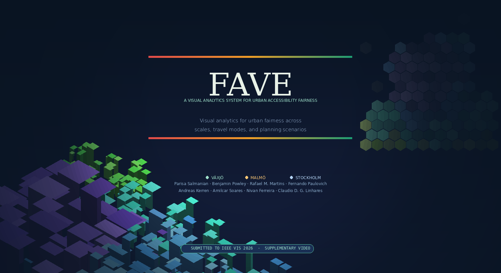

<p align="center">
  
</p>

<p align="center">
  <a href="#-about"></a>
  <a href="#-getting-started"></a>
  <a href="#-getting-started"></a>
  <a href="LICENSE"></a>
</p>

<p align="center">
  <b>A Visual Analytics System for Urban Accessibility Fairness</b><br/>
  <sub>Visual analytics for urban fairness across scales, travel modes, and planning scenarios</sub>
</p>

---

## 🗺️ About

**FAVE** is an interactive visual analytics system built on OpenStreetMap data that enables researchers and urban planners to explore, compare, and assess **accessibility fairness** across cities. It supports multiple travel modes, spatial scales, and what-if planning scenarios — powered by a local LLM through Ollama.

<p align="center">
  
  
  
</p>

---

## 🎥 Demo

<p align="center">
  <a href="https://youtu.be/WvCThY4LkWk">
    
  </a>
  <br/>
  <sub>▶️ Click to watch the demonstration video</sub>
</p>

---

## 🚀 Getting Started

### Prerequisites

| Tool | Purpose |
|------|---------|
| **Python 3.10+** | Backend API |
| **[Ollama](https://ollama.com)** | Local LLM inference |
| **Git LFS** | Large file storage |

### 1️⃣ Clone the repository

```bash
git lfs install
git clone https://github.com/FAVE/<repo-name>.git
cd <repo-name>
```

### 2️⃣ Install dependencies

```bash
python3 -m venv .venv
source .venv/bin/activate
pip install -r requirements.txt
```

### 3️⃣ Pull the LLM model (one-time)

```bash
ollama serve          # start the Ollama daemon
ollama pull llama3.2  # download the model
```

### 4️⃣ Launch

Open **three terminals** and run:

| Terminal | Command | Description |
|----------|---------|-------------|
| **A** | `uvicorn api.server:app --host 127.0.0.1 --port 8001 --reload` | Backend API |
| **B** | `cd frontend && python3 -m http.server 5500` | Frontend server |
| **C** | `ollama serve` | LLM service _(if not already running)_ |

Then open the app:

🟢 **App** → [http://127.0.0.1:5500/index.html](http://127.0.0.1:5500/index.html)  
🔵 **Health check** → [http://127.0.0.1:8001/health](http://127.0.0.1:8001/health)

---

## 🏗️ Project Structure

```
FAVE/
├── api/               # FastAPI backend
│   └── server.py
├── frontend/          # Static frontend (HTML/JS)
│   └── index.html
├── requirements.txt   # Python dependencies
└── README.md
```

---

## 👥 Authors

<table>
  <tr>
    <td align="center"><b>Parisa Salmanian</b></td>
    <td align="center"><b>Benjamin Powley</b></td>
    <td align="center"><b>Rafael M. Martins</b></td>
    <td align="center"><b>Fernando Paulovich</b></td>
  </tr>
  <tr>
    <td align="center"><b>Andreas Kerren</b></td>
    <td align="center"><b>Amilcar Soares</b></td>
    <td align="center"><b>Nivan Ferreira</b></td>
    <td align="center"><b>Claudio D. G. Linhares</b></td>
  </tr>
</table>

---

## 📄 License

This project is licensed under the **Apache License 2.0** — see the [LICENSE](LICENSE) file for details.

Code is released under [Apache 2.0](https://www.apache.org/licenses/LICENSE-2.0). Other materials (data, figures, documents) are released under [CC BY 4.0](https://creativecommons.org/licenses/by/4.0/), as recommended by IEEE VIS 2026.

---

<p align="center">
  <sub>Submitted to <b>IEEE VIS 2026</b> · Supplementary Video</sub><br/>
  <sub>Made with 🌿 for fairer cities</sub>
</p>
