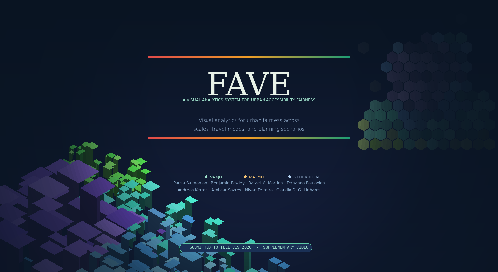

<p align="center">
  
</p>

<p align="center">
  <a href="#-about"></a>
  <a href="#-getting-started"></a>
  <a href="#-getting-started"></a>
  <a href="LICENSE"></a>
</p>

<p align="center">
  <b>A Visual Analytics System for Urban Accessibility Fairness</b><br/>
  <sub>Visual analytics for urban fairness across scales, travel modes, and planning scenarios</sub>
</p>

---

## 🗺️ About

**FAVE** is an interactive visual analytics system built on OpenStreetMap data that enables researchers and urban planners to explore, compare, and assess **accessibility fairness** across cities. It supports multiple travel modes, spatial scales, and what-if planning scenarios — powered by a local LLM through Ollama.

<p align="center">
  <a href="#-about"></a>
  <a href="#-about"></a>
  <a href="#-about"></a>
</p>

---

## 🎥 Demo

<p align="center">
  <a href="https://youtu.be/WvCThY4LkWk">
    
  </a>
  <br/>
  <sub>▶️ Click to watch the demonstration video</sub>
</p>

---

## 🚀 Getting Started

### Prerequisites

| Tool | Purpose |
|------|---------|
| **Python 3.9 – 3.12** | Backend API |
| **[Ollama](https://ollama.com)** | Local LLM inference |
| **[Git LFS](https://git-lfs.com)** | Only for Option B below (`git clone`) — city data lives in LFS |

> ⚠️ **Python 3.13 and newer will not work.** The pinned `numpy` and `shapely` versions have no prebuilt packages for them, so `pip install` fails. Check yours with `python3 --version`.

### 1️⃣ Get FAVE

#### Option A — download the ready-to-run ZIP (easiest)

1. Open the **[latest release](https://github.com/parisa-salmanian/FAVE/releases/latest)** and download **`FAVE-v2.0-full.zip`** (about 1.1 GB).
2. Unzip it (about 4 GB on disk) and open a terminal in the `FAVE` folder.

The ZIP contains the code **and** all city data, so no Git or Git LFS is needed. Pick `FAVE-v2.0-full.zip`, not the "Source code" links that GitHub adds to every release. Then continue with step 2️⃣.

#### Option B — clone with Git

```bash
git lfs install     # one-time per machine — do this BEFORE cloning
git clone https://github.com/parisa-salmanian/FAVE.git
cd FAVE
```

The clone downloads about **2 GB** (≈ 1.5 GB of it is city data stored in Git LFS) and takes about **4 GB** on disk.

> ⚠️ **Check that the data arrived.** `frontend/assets/data/byggnad_malmo.geojson` should be about **44 MB**. If it is only ~130 bytes, you have Git LFS *pointer* files instead of the data, and the app will open with an **empty map**. Fix it from inside the repo folder:
>
> ```bash
> git lfs install
> git lfs pull
> ```
>
> Prefer Option A or `git clone` over GitHub's green **Code → Download ZIP** button — that ZIP may contain the pointer files instead of the data.

### 2️⃣ Install dependencies

```bash
python3 -m venv .venv        # use a Python between 3.9 and 3.12, e.g. python3.12 -m venv .venv
source .venv/bin/activate    # on Windows: .venv\Scripts\activate
pip install -r requirements.txt
```

### 3️⃣ Pull the LLM model (one-time)

```bash
ollama serve          # start the Ollama daemon
ollama pull llama3.2  # download the model
```

### 4️⃣ Launch

Open **three terminals** and run:

| Terminal | Command | Description |
|----------|---------|-------------|
| **A** | `uvicorn api.server:app --host 127.0.0.1 --port 8001 --reload` | Backend API |
| **B** | `cd frontend && python3 -m http.server 5500` | Frontend server |
| **C** | `ollama serve` | LLM service _(if not already running)_ |

Then open the app:

🟢 **App** → [http://127.0.0.1:5500/index.html](http://127.0.0.1:5500/index.html)  
🔵 **Health check** → [http://127.0.0.1:8001/health](http://127.0.0.1:8001/health)

---

## 🏗️ Project Structure

```
FAVE/
├── api/                          # FastAPI backend
│   └── server.py
├── frontend/                     # Static frontend (HTML/JS)
│   ├── index.html
│   └── assets/
│       ├── js/                   # MVC modules (lib/models/views/controllers)
│       ├── css/
│       └── data/                 # Small static data (POIs, district boundaries,
│                                 # population JSON). Large building geojsons and
│                                 # baked city products live here too (Git LFS).
├── tools/
│   └── bake_city_data.py         # Offline POI baker (Overpass/Nominatim)
├── requirements.txt              # Python dependencies
└── README.md
```

### Lantmäteriet building geometry (full Sweden, optional)

The geojsons in LFS are slimmed for the demo. If you want the **authoritative building footprints from Lantmäteriet** (Sweden's land survey agency) — for example to extend FAVE to a kommun that isn't in the demo, or to refresh the geometry — there's a fetcher:

```bash
# List every kommun in the Byggnader collection (~290 entries)
python tools/fetch_lantmateriet_buildings.py --list

# Filter the listing by name fragment
python tools/fetch_lantmateriet_buildings.py --list --kommun-name lund

# Pull a known FAVE city by alias
python tools/fetch_lantmateriet_buildings.py --city vaxjo

# Pull by raw 4-digit kommun code (e.g., 0180 = Stockholm, 1480 = Göteborg)
python tools/fetch_lantmateriet_buildings.py --kommun 0180 --kommun 1480

# Pull by readable name (substring, case-insensitive)
python tools/fetch_lantmateriet_buildings.py --kommun-name "Lund" --kommun-name "Helsingborg"

# Pull every kommun in Sweden (≈ 3-4 GB unzipped)
python tools/fetch_lantmateriet_buildings.py --all
```

The data is published by Lantmäteriet under **CC-BY-4.0** — no API key or OAuth flow is required, just a registered Lantmäteriet account agreeing to the license. Files land in `lantmateriet/byggnader/byggnad_kn<code>.gpkg` (EPSG:3006 / SWEREF 99 TM), and the cached ZIPs in `lantmateriet/zip/`. The whole `lantmateriet/` folder is gitignored.

#### Convert the kommun GeoPackages into FAVE building geojsons

Once the .gpkg files are in place, `tools/process_lantmateriet_buildings.py` reprojects them to EPSG:4326 (lon/lat — what the frontend uses), drops attribute columns FAVE doesn't read, and writes a compact GeoJSON straight into `frontend/assets/data/`. Output filenames pick up the FAVE city alias when the kommun matches one (e.g., `byggnad_vaxjo.geojson`); otherwise it's `byggnad_kn<code>.geojson`.

```bash
# Process every .gpkg currently in lantmateriet/byggnader/
python tools/process_lantmateriet_buildings.py

# Or pick specific kommuner
python tools/process_lantmateriet_buildings.py --city vaxjo --city malmo
python tools/process_lantmateriet_buildings.py --kommun 0180

# Don't overwrite existing geojsons
python tools/process_lantmateriet_buildings.py --skip-existing
```

This step uses **geopandas** (declared in `requirements.txt`). After processing, the resulting geojsons are drop-in replacements for the LFS-tracked demo data.

---

## 👥 Authors

<table>
  <tr>
    <td align="center"><b>Parisa Salmanian</b></td>
    <td align="center"><b>Benjamin Powley</b></td>
    <td align="center"><b>Rafael M. Martins</b></td>
    <td align="center"><b>Fernando Paulovich</b></td>
  </tr>
  <tr>
    <td align="center"><b>Andreas Kerren</b></td>
    <td align="center"><b>Amilcar Soares</b></td>
    <td align="center"><b>Nivan Ferreira</b></td>
    <td align="center"><b>Claudio D. G. Linhares</b></td>
  </tr>
</table>

---

## 📄 License

This project is licensed under the **Apache License 2.0** — see the [LICENSE](LICENSE) file for details.

Code is released under [Apache 2.0](https://www.apache.org/licenses/LICENSE-2.0). Other materials (data, figures, documents) are released under [CC BY 4.0](https://creativecommons.org/licenses/by/4.0/), as recommended by IEEE VIS 2026.

---

<p align="center">
  <sub>Submitted to <b>IEEE VIS 2026</b> · Supplementary Video</sub><br/>
  <sub>Made with 🌿 for fairer cities</sub>
</p>
